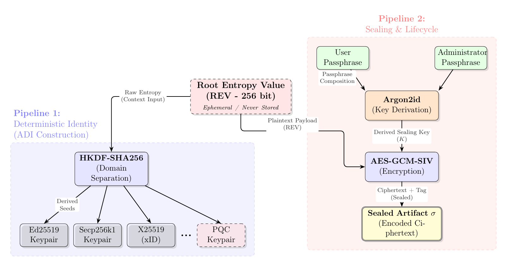
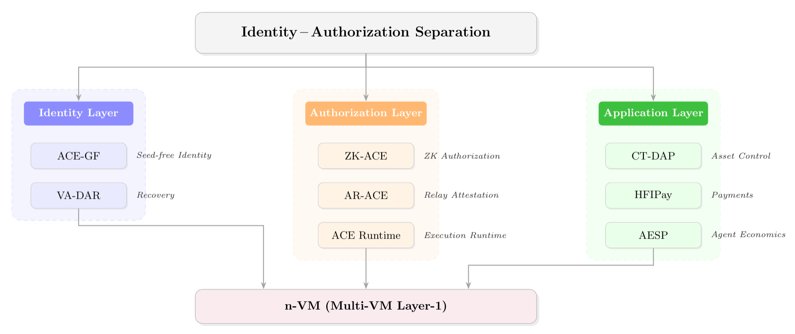

# Rethinking What We Assumed About Blockchain

*Let private key be private. Unleash the authorization layer.*

## Summary

Since Bitcoin, blockchains have treated identity, authorization, and control as a single object — the private key. That compression served the ecosystem well for over a decade, but it is now under strain from multiple directions at once. Consider, for example, the post-quantum threat: every on-chain transaction today exposes the sender's public key, and "harvest now, decrypt later" (HNDL) attackers are already archiving blockchain data for future quantum decryption. The private-key-as-identity model makes this exposure structural — the public key *is* the identity, so it cannot be hidden. Meanwhile, the signatures designed to resist quantum attack (e.g., ML-DSA) are an order of magnitude larger than their classical counterparts, making consensus-path verification disproportionately expensive. Institutions entering the space need conditional, revocable control that a permanent private key cannot express. AI agents need to transact autonomously within bounded authority. Wallet recovery still reduces to safeguarding a single master backup. Cross-chain identity fragments across every network a user touches. And the cost of “every node verifies every signature” scales linearly in ways that post-quantum cryptography will make dramatically worse.

This article explores a structural adjustment: separating identity binding from per-transaction authorization. In this model, the identity root — reconstructed deterministically from a sealed artifact and credentials — anchors *who you are*. Authorization — zero-knowledge proofs, HMAC attestations, policy gates — becomes a separate, context-specific layer for *what may be done*. ACE-GF (Atomic Cryptographic Entity Generative Framework) provides one concrete instantiation of this separation.

Pushing it through the full stack — not just key management — opens a design space where many outcomes are unavailable today or reachable only at enormous cost: authorization without parking full signature objects on the consensus path; conditional control without chain-specific contract logic; wallet recovery without a single master seed; unified identity across execution environments without bridges; payments to human-readable identifiers without publishing address mappings; and identity continuity across cryptographic generations, so that a routine PQC upgrade does not mean migrating every user’s assets to a new identity.

The architecture is meant to be built as a new chain or layer, not patched onto existing assumptions. Developers get a stack where identity, authorization, and execution evolve independently — and where succinct proof systems serve as load-bearing authorization infrastructure, not merely compression around signatures. Institutions get conditional control and revocation expressed in cryptographic structure rather than contract code. End users get recovery and payments that do not reduce to a mnemonic or a globally visible identifier-to-address map. The open questions — engineering feasibility, ecosystem adoption, operational reliability — are addressed at the end.

## Introduction

In January 2009, the first Bitcoin transaction embedded a simple but powerful idea: a private key signs a message, the network verifies the signature, and that's all you need. Identity *is* the key. Authorization *is* the signature. Control *is* possession.

This compression — identity, authorization, and control collapsed into a single cryptographic object — has defined every blockchain built since. It was elegant. It was sufficient. And for nearly two decades, no one seriously questioned it.

But the pressures summarized above are not isolated issues with isolated fixes. They share a common root: the private key is being asked to do too many jobs at once. The industry's response, so far, has been to optimize within the existing framework — compress signatures with zero-knowledge proofs, wrap keys in smart contract wallets, build bridges between fragmented identities, add multisig layers for governance. Each solution addresses a symptom while preserving the root assumption.

What if we questioned the assumption itself?

ACE-GF (Atomic Cryptographic Entity Generative Framework) proposes a seemingly small but structural adjustment: **separating identity binding from per-transaction authorization**. The identity root — a deterministic, ephemeral reconstruction from a sealed artifact and authorization credentials — becomes the anchor. Authorization becomes a separate, pluggable layer that can be instantiated differently depending on context: a zero-knowledge proof for on-chain consensus, an HMAC attestation for mempool relay, a policy gate for AI agent transactions.

This single separation, followed to its logical conclusions, forces us to rethink eight assumptions that the entire blockchain stack is built on. Not as incremental improvements, but as structural redesigns — the kind that become possible only when you change what's at the foundation.

---

## ACE-GF: A Concrete Instantiation

### What If We Separate Identity and Authorization for Crypto?

In ACE-GF's construction, a 256-bit Root Entropy Value (REV) exists only ephemerally in memory — sealed under the user's passphrase at rest, and used to derive context-isolated keys for all target environments before being zeroed. Identity and authorization are two independent pipelines that meet only at this ephemeral point:

**Pipeline 1** (left) derives all cryptographic material from the REV — each algorithm and domain gets an independent key family via context-isolated HKDF, and adding PQC is just a new derivation context. **Pipeline 2** (right) controls who can access the identity — credentials seal and unseal the REV, and can be rotated or revoked without changing the identity itself. The REV exists only in memory during the Unseal operation, never at rest.

This is one concrete instantiation of identity–authorization separation. The sections below work through eight consequences; the article closes with a **full-stack** synthesis.

---

## 1. Control ≠ Holding a Private Key

**The assumption we've accepted:** Control over digital assets is equated with permanent possession of a private key. Transferring control means transferring the key itself.

**Why it's breaking:** This model forces a binary: you either have the key (full control) or you don't (no control). There is no native way to express control that is temporary, conditional, delegated, or revocable. Inheritance, regulatory supervision, institutional governance — all require nuanced control semantics that a single private key fundamentally cannot represent. Every workaround (multisig, smart contracts, custodians) adds complexity while pushing the actual control logic outside the cryptographic trust boundary.

**After separation:** When identity and authorization are independent, control becomes a question of *which authorization paths are currently constructible*, not *who holds a secret*. The identity root remains stable and unchanged; what varies is whether the credentials needed to activate a particular authorization path are available. New paths can be created, existing paths can be made dormant, and active paths can be permanently destroyed — all without modifying the identity itself or touching on-chain state.

This reframes control from a static property (possession) to a dynamic one (activation). Section 3 below explores the concrete mechanisms — dormant authorization paths, destructible factors, condition-triggered activation — that make this work in practice.

**Why it matters:** The "key = control" model was designed for a world of self-custodied bearer assets. As crypto assets enter regulated financial systems — RWA tokenization, institutional custody, estate planning — the inability to express conditional, revocable control at the cryptographic layer is becoming a structural barrier, not just a UX inconvenience.

---

## 2. Transaction Authorization ≠ Carrying a Signature

**The assumption we've accepted:** Every transaction must carry a cryptographic signature, and consensus nodes verify each signature individually.

This is perhaps the most deeply embedded assumption in all of blockchain — so natural that questioning it feels almost heretical. Satoshi's original Bitcoin transaction is, at its core, a signed message. Every chain since has preserved this model: produce a signature, attach it to the transaction, have every node verify it independently.

**Why it's breaking:** In two directions simultaneously. First, verification cost scales linearly with transaction volume — O(N) signature verification per block is a core bottleneck for high-performance chains, forcing Solana to require every validator to run a GPU just for signature verification. Second, post-quantum signatures (e.g., ML-DSA at NIST Security Level 2) are approximately 2,420 bytes — roughly 38× larger than Ed25519's 64 bytes. Directly posting them on-chain would make rollup calldata and L1 block sizes unacceptable.

**The current mitigation path — and its ceiling.** The widely discussed approach is to compress post-quantum signatures using zero-knowledge proofs: verify the signature inside a ZK circuit, publish only the succinct proof on-chain. This is a natural application of proof systems — elegant, even. Use the proof to attest that a valid signature exists without transmitting it.

But look at what this actually does to the proof system. The lattice arithmetic that makes post-quantum signatures secure is expensive. Moving it inside a ZK circuit does not eliminate that cost — it shifts it from the verifier to the prover. The prover must now perform the full signature verification inside the circuit, plus the overhead of proof generation. We have traded on-chain data bloat for off-chain computational bloat. The signature — the original source of the problem — remains at the center of the architecture. The proof system, no matter how powerful, is reduced to a compression utility for another primitive.

Consider the irony: STARKs were invented to provide scalable, transparent, post-quantum-secure proofs of computational integrity. They are among the most powerful cryptographic tools ever built. And in the signature-compression model, we are asking them to do janitorial work — making bloated signatures fit where they otherwise wouldn't.

**After separation:** Step back and ask: what does the consensus layer actually need? Not the signature itself, but the semantic guarantee that *this transaction was authorized by the correct identity*.

ZK-ACE takes this literally. Instead of compressing a post-quantum signature into a proof, it removes the signature from the consensus path entirely. The prover demonstrates in zero knowledge that their identity is consistent with an on-chain commitment and that the transaction has been authorized — without generating, transmitting, or verifying any signature object. The proof does not attest that "a valid signature exists somewhere." It directly attests that "this transaction is authorized by this identity."

The implications ripple through the entire stack. Block-level verification shifts from O(N) individual signature checks to a single aggregated proof — O(1). Post-quantum signature bloat becomes irrelevant, because there are no signatures on the consensus path to bloat. And the role of proof systems in the architecture undergoes a fundamental inversion.

In the compression model, the proof system is subordinate to the signature scheme — it exists to make signatures fit where they otherwise wouldn't. The signature is the primitive; the proof is the optimization.

In the direct-authorization model, this hierarchy flips. The proof system *is* the authorization primitive. Its expressiveness, its scalability properties, its post-quantum security, its prover efficiency — these are no longer nice-to-have optimizations. They are load-bearing structural requirements of the consensus mechanism itself. Every transaction's authorization flows through the proof system, not because it makes the system faster, but because the proof *is* the authorization.

This is the environment that scalable, transparent proof systems — STARKs being the canonical example — were built for. Not compressing signatures into smaller signatures, but providing direct, scalable attestations of computational statements. The statement is simply: "this transaction is authorized by the identity committed on-chain." The mathematics doesn't change. What changes is whether we ask the mathematics to serve a peripheral role or a foundational one.

**Why it matters:** Post-quantum migration is a universally acknowledged necessity, but the industry lacks viable paths that do not introduce significant performance degradation. Bypassing signatures to prove authorization directly offers a structural resolution — one that positions succinct proof systems at the very center of the blockchain trust model, rather than at its periphery.

---

## 3. Conditional Control ≠ Smart Contract Logic

**The assumption we've accepted:** When asset control needs to be conditional — activated upon inheritance, delegated under regulatory supervision, shared across institutional governance — the solution is a smart contract, a custodian, or a multisig arrangement.

**Why it's breaking:** Each of these approaches conflates control with something it shouldn't be tied to. Smart contracts enable conditional execution, but at the cost of on-chain state mutation, oracle dependencies, code immutability risks, and chain-specific logic — a conditional transfer on Ethereum has no meaning on Solana. Multisig and threshold signature schemes distribute control across parties, but require persistent availability of all participating keys, and changing conditions means resharing or migrating assets. Custodial solutions externalize control to intermediaries, sacrificing the very property that makes crypto assets distinctive: cryptographic self-sovereignty.

The core problem is deeper: in the current model, transferring control means transferring a key or its authority. There is no native cryptographic mechanism for control that is *temporarily inactive*, *conditionally enabled*, and *revocable without state changes*.

**After separation:** CT-DAP (Condition-Triggered Dormant Authorization Paths) models control rights as dormant authorization paths — composed of user-held credentials and one or more administrative authorization factors held by independent custodians. A control right is cryptographically nonexistent until all required factors are simultaneously available. The key insight: *control of encrypted assets need not be transferred; it can be activated*.

An inheritance path, for example, consists of the heir's credentials plus an administrative factor held by a legal executor. Under normal conditions, the heir cannot reconstruct the authorization path — the factor simply doesn't exist in their possession. Upon the triggering event, the executor releases the factor, and the path becomes constructible. Revocation is achieved by destroying the administrative factor — immediate, permanent, no on-chain transaction required, no state mutation, no key rotation.

This works because identity–authorization separation makes authorization factors independent of the identity root. Destroying or releasing a factor does not affect the underlying identity or any other authorization path derived from it.

**Why it matters:** As regulated financial products — estate planning, institutional custody, compliance-governed accounts — move onto blockchain infrastructure, the industry needs conditional control that is cryptographically enforceable, legally auditable, and chain-agnostic. Expressing these control semantics at the cryptographic layer, rather than in contract code or custodial agreements, means the enforcement mechanism is portable across chains and verifiable without trusting any intermediary's execution.

---

## 4. Wallet Recovery ≠ Backing Up a Seed

**The assumption we've accepted:** Deterministic wallet recovery relies on persistent backup of a master seed — typically stored as a mnemonic phrase.

**Why it's breaking:** The mnemonic user experience is catastrophic. It is essentially a human-readable encoding of a high-entropy key, requiring users to securely store 12–24 words on a physical medium with zero tolerance for error. Numerous users have permanently lost assets due to lost mnemonics. More fundamentally, the master seed is a single point of failure — once compromised, all keys derived from it, past and future, are irreversibly exposed.

Passkeys and WebAuthn improve local authentication but do not constitute a complete decentralized recovery protocol. Smart contract recovery (e.g., social recovery) requires pre-configured guardians, is visible on-chain, and is chain-specific.

**After separation:** ACE-GF eliminates the concept of a "master seed." The identity root exists only ephemerally in memory, deterministically reconstructed from a sealed artifact and authorization credentials, never persistently stored. On this foundation, VA-DAR builds a decentralized discovery-and-recovery layer: users need only an identifier (e.g., email) and a recovery passphrase for cross-device recovery, while the registry's discovery identifier is passphrase-derived, preventing attackers from enumerating wallet holders by traversing identifiers.

The prerequisite for recovery is no longer "you safeguarded that piece of paper," but "you remember your email and passphrase."

**Why it matters:** Wallet recovery is one of the last barriers to cryptocurrency mass adoption. A recovery scheme that is vendor-agnostic, chain-agnostic, enumeration-resistant, and PQC-ready directly impacts the onboarding path for the next billion users.

---

## 5. Paying Someone ≠ Knowing Their Address

**The assumption we've accepted:** Sending cryptocurrency requires the sender to know the recipient's on-chain address. Human-friendly identifier schemes (e.g., ENS, Solana Name Service) map identifiers directly to addresses via public registries, making the mapping globally visible.

**Why it's breaking:** Opaque hexadecimal addresses are a primary UX barrier to cryptocurrency adoption. Yet naïve identifier-to-address mapping introduces a critical privacy vulnerability: anyone who knows a user's email, phone number, or social handle can derive their on-chain address and inspect their entire transaction history, balances, and counterparty relationships. For public figures, a single known identifier can reconstruct a complete financial profile across every supported chain.

Stealth-address schemes (e.g., ERC-5564) mitigate linkability but still require the sender to know the recipient's public key or meta-address, and the recipient must scan every transaction to detect incoming payments. Neither approach achieves the UX simplicity of "send to email" with full privacy.

**After separation:** HFIPay decouples identifier routing, sender-side quote verification, and on-chain claim authorization. The sender specifies only a human-friendly identifier; a relay privately resolves it off-chain, derives a one-time deposit address, and commits only a per-intent blinded binding plus the quoted payment tuple on-chain. The chain sees neither the identifier nor a reusable recipient tag. The recipient later claims by proving in zero knowledge — via ZK-ACE — that the funded intent's blinded binding matches a handle derived from the same deterministic identity, authorizing release to a chosen destination. In a verified-quote deployment, the relay furnishes a sender-verifiable proof that the quoted binding is tied to the attested recipient, preventing recipient substitution before funding.

This mirrors the ACE pattern: human-readable routing and relay resolution sit outside the authorization boundary; the ledger enforces only blinded commitments and zero-knowledge authorization that the claim is consistent with the bound identity — identifier resolution and on-chain settlement are separate layers, as in the rest of the stack.

The relay is non-custodial by design: it is a privacy and availability dependency, but it cannot redirect funds. Claim authorization lives on-chain, enforced by the same zero-knowledge proof layer that authorizes regular transactions.

**Why it matters:** "Send crypto to an email address" is a long-sought UX goal, but every prior approach sacrificed either privacy (public registries) or decentralization (custodial intermediaries that can redirect funds). HFIPay achieves the UX target without either tradeoff. When composed with an n-VM architecture, the same claim mechanism extends to cross-chain settlement, making "send to email on any chain" a single unified flow.

---

## 6. Cross-Chain ≠ Bridging

**The assumption we've accepted:** Users maintain different key pairs and addresses on different chains, and cross-chain asset transfers rely on bridges — third-party systems that lock, mint, and verify.

**Why it's breaking:** Bridges are the single largest source of security failures in decentralized finance. Between 2021 and 2024, bridge exploits resulted in losses exceeding $2.8 billion. The root cause is identity fragmentation: the same user is an entirely different cryptographic entity on EVM, SVM, Bitcoin, and TVM, and cross-chain operations must establish trust between these different entities through external systems.

Existing multi-VM projects (Movement Labs, Eclipse, Sei v2) attempt to run multiple execution environments on a single chain, but typically subordinate one VM to another. Identity remains fragmented across VMs, and token transfers still require bridge-like mechanisms.

**After separation:** When the identity layer is decoupled from the execution environment, a single 32-byte identity commitment can deterministically generate native addresses for each VM through context-isolated HKDF derivation. Chain- and VM-specific parameters are folded entirely into the derivation context, so the identity anchor stays fixed while each execution environment gets its own isolated address family — the commitment does not depend on any particular VM's signing rules or address format. n-VM builds on this to construct a multi-VM Layer-1 architecture where EVM, SVM, BVM, and TVM coexist as co-equal execution environments on the same chain, sharing consensus, state, and a unified token ledger. Cross-VM token transfers are atomic operations on the same ledger, not bridge transactions.

**Why it matters:** Cross-chain interoperability is a decade-old unsolved problem. Starting from identity-layer unification, the "cross-chain" problem can be redefined as "cross-VM calls on the same chain," architecturally eliminating the need for bridges.

---

## 7. Verification ≠ Every Node Doing the Same Work

**The assumption we've accepted:** In blockchain networks, every node performs the same verification workflow for every transaction — including signature verification, transaction execution, and state transition.

**Why it's breaking:** This model leads to resource waste at two levels. At the network layer, if every propagated object carries a full validity proof (approximately 128 KB in post-quantum settings), relay bandwidth grows linearly with object count. At the execution layer, every validator independently performs O(N) signature verification, and in post-quantum settings must handle bloated signature data.

**After separation:** Identity–authorization separation enables verification responsibilities to be stratified by role. At the network layer, AR-ACE implements "proof-off-path" propagation — relay nodes forward transactions with only lightweight attestations (identity-bound commitments), without generating or carrying full validity proofs. Proof generation happens once, at the end of the pipeline, when the builder aggregates an entire block's worth of authorization statements.

At the execution layer, ACE Runtime replaces per-transaction signature verification with HMAC-based attestations — approximately 1 microsecond per transaction — and moves zero-knowledge proof generation off the critical path into a parallel pipeline phase. The three-phase Attest–Execute–Prove architecture targets 400 ms block times and sub-second cryptographic finality on commodity hardware, without requiring validators to run GPUs.

The result is a layered verification architecture where each role performs only the work appropriate to its responsibilities: relay nodes perform the lightest admission checks, validators handle attestation verification and transaction execution, and builders perform aggregated proof generation. The builder's aggregated proof — a single succinct attestation covering all transactions in the block — is where the full weight of the proof system is brought to bear. Because this happens exactly once per block rather than once per transaction, it is where scalable, transparent proof systems deliver their maximum leverage: one proof, full block coverage, post-quantum security by construction.

**Why it matters:** Blockchain scalability bottlenecks largely stem from the implicit assumption that "all nodes do the same work." Proposer-builder separation is already an industry trend, but identity–authorization separation provides a clean cryptographic foundation for this stratification — the authorization layer can be instantiated differently at each tier (HMAC at relay, attestation at validator, aggregated ZK proof at builder) without compromising the end-to-end security guarantee.

---

## 8. Agent Autonomy ≠ Economic Sovereignty

**The assumption we've accepted:** When AI agents participate in economic activity, they are either fully trusted (given a wallet) or fully untrusted (every transaction manually approved).

**Why it's breaking:** This binary model is unsustainable as agent capabilities grow rapidly. Full trust means an agent can unilaterally drain a wallet — an unacceptable risk. Per-transaction approval negates the entire value of agent automation — if every operation requires human confirmation, the agent is nothing more than a glorified form-filling tool.

**After separation:** Identity–authorization separation naturally provides a foundation for layered control over agent economic behavior. Deterministic policy can constrain or trim the effective authorization path available to each agent — limits, allowlists, and budgets determine which transactions may be authorized — without rotating the identity root or changing its on-chain commitments. AESP defines the central invariant "economically capable but never economically sovereign": agents possess cryptographic identities and transaction capabilities, but every economic action must pass through deterministic policy gates (per-transaction limits, address allowlists, budgets, time windows), with actions that fail policy checks escalated to human approval. Each transaction uses an HKDF-derived ephemeral address, and different agent contexts are cryptographically isolated — the transaction patterns of a user's procurement agent and investment agent cannot be correlated by on-chain observers.

**Why it matters:** AI agents are evolving from information-processing tools into economic actors. What the industry needs is not "bigger wallets for agents" or "more frequent human approvals," but a protocol-level boundary definition — specifying what agents can do autonomously, what they cannot, and how to escalate when boundaries are exceeded. The absence of standardization at this layer will become a structural barrier to scaling the agent economy.

---

## Architecture

### Full Stack

The eight rethinks above are not independent observations. They are logical consequences of the same structural separation applied at different levels of the blockchain stack:

One primitive, one separation, eight rethinks — covering the full trust stack from key management to the agent economy.

What holds this architecture together is not a shared codebase or a monolithic protocol, but a shared structural insight: the conflation of identity with authorization was a reasonable simplification in 2009, but it has become the load-bearing constraint that limits what blockchains can express. Relaxing it — carefully, with formal security guarantees at each layer — opens design space that was previously inaccessible.

There is a deeper consequence worth noting. In the pre-separation world, proof systems occupy a specific and somewhat constrained niche: they compress rollup state, they enable private computations, they make existing data structures smaller. Valuable work, but peripheral to the core trust model. The chain's trust ultimately rests on signatures.

In the post-separation architecture, proof systems move to the center. ZK-ACE makes the proof the authorization primitive for every transaction. AR-ACE funnels all authorization through a single builder-generated proof per block. ACE Runtime builds its entire execution pipeline around the Attest–Execute–Prove cycle. HFIPay's claim authorization is a zero-knowledge proof. Even cross-VM identity verification in n-VM can be instantiated as proof-based attestation.

The authorization layer *is* the proof layer. The proof system's properties — scalability, transparency, post-quantum security, prover efficiency — are no longer features of an optimization tool. They are the consensus-critical parameters that determine what the chain can do and how fast it can do it. Proof systems designed for this role — scalable, transparent, quantum-resistant by construction — are not just compatible with this architecture. They are its natural foundation.

---

## Open Questions

Any challenge to long-standing paradigms must honestly face its own uncertainties:

- **Engineering feasibility.** Performance figures in the papers come from analytical modeling and component-level benchmarks. The engineering complexity of an end-to-end system — state management, error handling, debugging toolchains — has not yet been validated in production.
- **Ecosystem adoption path.** Restructuring at the identity layer means this cannot be deployed as an incremental upgrade to existing chains. It must be built as a new chain or Layer-2 from scratch, significantly raising the bar for market adoption.
- **Operational reliability.** In the seed-storage-free model, simultaneous availability of the sealed artifact and authorization credentials is a prerequisite for system availability. Real-world performance at scale — including credential loss rates, recovery success rates, and user cognitive burden — requires deployment data.
- **Security under adversarial conditions.** Formal proofs are based on mature standard assumptions, but the security of composed protocols under adversarial conditions still requires independent audits and long-term operational validation.
- **Proof system maturity.** The architecture's reliance on succinct proofs as the authorization primitive means that prover performance, proof size, and verification cost are no longer peripheral concerns — they are consensus-critical parameters. Continued advances in proof system engineering are a prerequisite for production viability.

---

## Conclusion

For nearly two decades, the blockchain industry has been building on assumptions inherited from a 2009 whitepaper: private key as control, signature as authorization, seed as identity, bridge as cross-chain, address as payment target. Each assumption was reasonable when it was made. Each has become a structural constraint as the demands on blockchain systems have expanded beyond what Satoshi could have anticipated.

Identity–authorization separation does not claim to solve all of these problems. It claims something more specific: that many of these constraints share a common root — the conflation of identity with authorization — and that carefully separating them, with formal guarantees at each layer, opens design paths that were previously invisible.

One thread runs through all eight rethinks. The separation transforms proof systems from an optimization layer into foundational infrastructure. In the current paradigm, zero-knowledge proofs make existing primitives more efficient — smaller signatures, compressed rollups, private computations. In the separated paradigm, proofs become the mechanism through which authorization itself is established. Every transaction on the chain passes through a proof system not because it makes the system faster, but because the proof *is* the authorization. This is not a marginal change in how we use these cryptographic tools. It is a reclassification of what role they play.

Whether these paths lead to production systems remains to be demonstrated. The distance from papers to working infrastructure, from proof of concept to ecosystem adoption, is often longer than the research itself. But the question is worth asking: are the things we've taken for granted for nearly twenty years truly the only way to build a blockchain — or are they simply the first way?

---

*All papers referenced in this article are available on arXiv and in the [papers repository](https://github.com/acechain-io/papers). A formal protocol specification of ACE-GF is available as an [IETF Internet-Draft](https://datatracker.ietf.org/doc/draft-wang-acegf-protocol/).*

*[ACE-GF](https://arxiv.org/abs/2511.20505) · [ZK-ACE](https://arxiv.org/abs/2603.07974) · [AR-ACE](https://arxiv.org/abs/2603.07982) · [ACE Runtime](https://arxiv.org/abs/2603.10242) · [VA-DAR](https://arxiv.org/abs/2603.02690) · [CT-DAP](https://arxiv.org/abs/2603.07933) · [AESP](https://arxiv.org/abs/2603.00318) · [n-VM](https://arxiv.org/abs/2603.23670) · [HFIPay](https://arxiv.org/abs/2603.26970)*

*Contact: jason@acechain.io · [@0xJasonw](https://x.com/0xJasonw)*
